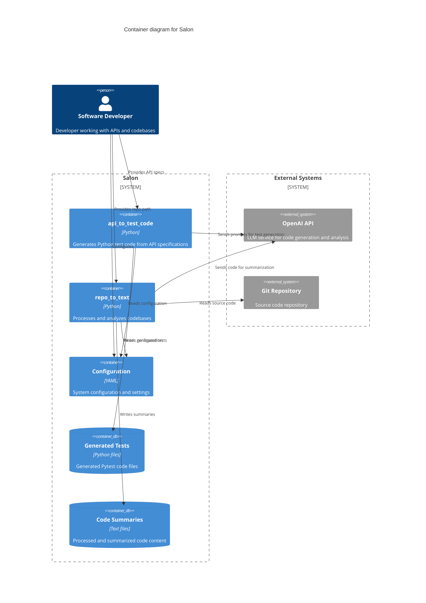

```mermaid
C4Container
title Container diagram for Salon

Person(developer, "Software Developer", "Developer working with APIs and codebases")

System_Boundary(salon, "Salon") {
    Container(api_to_test, "api_to_test_code", "Python", "Generates Python test code from API specifications")
    Container(repo_to_text, "repo_to_text", "Python", "Processes and analyzes codebases")
    
    Container(config, "Configuration", "YAML", "System configuration and settings")
    
    ContainerDb(output_tests, "Generated Tests", "Python files", "Generated Pytest code files")
    ContainerDb(output_summaries, "Code Summaries", "Text files", "Processed and summarized code content")
}

System_Boundary(external_systems, "External Systems") {
    System_Ext(openai, "OpenAI API", "LLM service for code generation and analysis")
    System_Ext(git, "Git Repository", "Source code repository")
}

Rel(developer, api_to_test, "Provides API specs")
Rel(developer, repo_to_text, "Provides repo path")
Rel(developer, config, "Configures")

Rel(api_to_test, openai, "Sends prompts for test generation")
Rel(api_to_test, output_tests, "Writes generated tests")
Rel(api_to_test, config, "Reads configuration")

Rel(repo_to_text, git, "Reads source code")
Rel(repo_to_text, openai, "Sends code for summarization")
Rel(repo_to_text, output_summaries, "Writes summaries")
Rel(repo_to_text, config, "Reads configuration")
```
