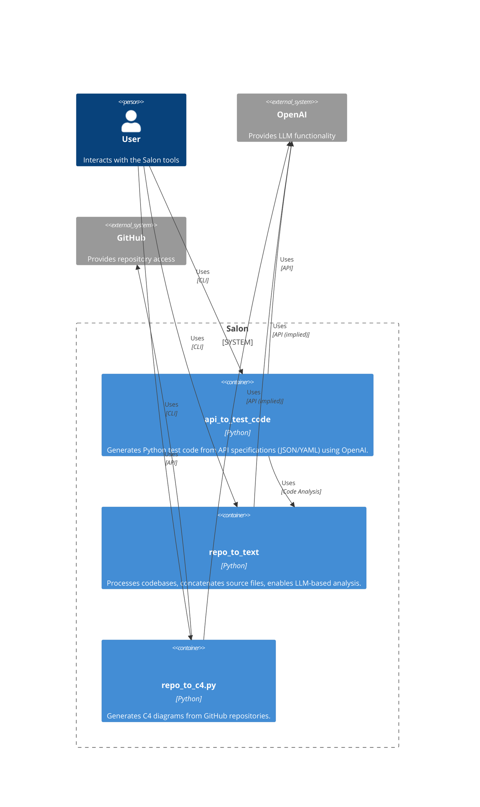

```mermaid
C4Context
  Person(user, "User", "Interacts with the Salon tools")

  System_Boundary(c1, "Salon") {
    Container(api_to_test_code, "api_to_test_code", "Python", "Generates Python test code from API specifications (JSON/YAML) using OpenAI.", "Python, OpenAI API")
    Container(repo_to_text, "repo_to_text", "Python", "Processes codebases, concatenates source files, enables LLM-based analysis.", "Python, NLTK")
    Container(repo_to_c4, "repo_to_c4.py", "Python", "Generates C4 diagrams from GitHub repositories.", "Python, GitHub API")

    Rel(user, api_to_test_code, "Uses", "CLI")
    Rel(user, repo_to_text, "Uses", "CLI")
    Rel(user, repo_to_c4, "Uses", "CLI")
    Rel(api_to_test_code, repo_to_text, "Uses", "Code Analysis")

  }

  System_Ext(openai, "OpenAI", "Provides LLM functionality")
  Rel(api_to_test_code, openai, "Uses", "API")
  Rel(repo_to_text, openai, "Uses", "API (implied)")
  Rel(repo_to_c4, openai, "Uses", "API (implied)")

  System_Ext(github, "GitHub", "Provides repository access")
  Rel(repo_to_c4, github, "Uses", "API")

```
