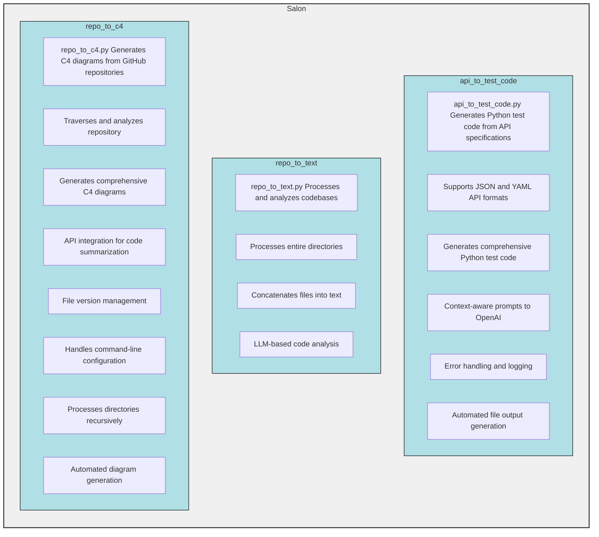

```mermaid
graph TB
    subgraph Salon
        direction TB
        subgraph api_to_test_code
            A1["api_to_test_code.py Generates Python test code from API specifications"] 
            A2["Supports JSON and YAML API formats"]
            A3["Generates comprehensive Python test code"]
            A4["Context-aware prompts to OpenAI"]
            A5["Error handling and logging"]
            A6["Automated file output generation"]
        end
        subgraph repo_to_text
            B1["repo_to_text.py Processes and analyzes codebases"]
            B2["Processes entire directories"]
            B3["Concatenates files into text"]
            B4["LLM-based code analysis"]
        end
        subgraph repo_to_c4
            C1["repo_to_c4.py Generates C4 diagrams from GitHub repositories"]
            C2["Traverses and analyzes repository"]
            C3["Generates comprehensive C4 diagrams"]
            C4["API integration for code summarization"]
            C5["File version management"]
            C6["Handles command-line configuration"]
            C7["Processes directories recursively"]
            C8["Automated diagram generation"]
        end
    end
    
    style Salon fill:#f0f0f0,stroke:#333,stroke-width:2px
    style api_to_test_code fill:#b0e0e6,stroke:#000,stroke-width:1px
    style repo_to_text fill:#b0e0e6,stroke:#000,stroke-width:1px
    style repo_to_c4 fill:#b0e0e6,stroke:#000,stroke-width:1px
```
