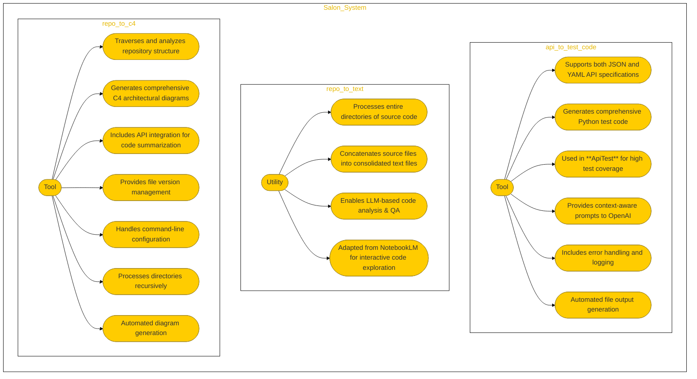

```mermaid
%%{init: {'theme': 'base', 'themeVariables': { 'background': '#f0f0f0', 'primaryColor': '#ffcc00', 'edgeLabelBackground':'#ffffff', 'clusterBkg': '#ffffff', 'clusterBorder': '#000000'}}}%%
graph TD
  subgraph Salon_System
    direction TB
    
    subgraph api_to_test_code
      atc_tool(["Tool"])
      atc_features_1(["Supports both JSON and YAML API specifications"])
      atc_features_2(["Generates comprehensive Python test code"])
      atc_features_3(["Used in **ApiTest** for high test coverage"])
      atc_features_4(["Provides context-aware prompts to OpenAI"])
      atc_features_5(["Includes error handling and logging"])
      atc_features_6(["Automated file output generation"])
      atc_tool --> atc_features_1
      atc_tool --> atc_features_2
      atc_tool --> atc_features_3
      atc_tool --> atc_features_4
      atc_tool --> atc_features_5
      atc_tool --> atc_features_6
    end
    
    subgraph repo_to_text
      rtt_utility(["Utility"])
      rtt_features_1(["Processes entire directories of source code"])
      rtt_features_2(["Concatenates source files into consolidated text files"])
      rtt_features_3(["Enables LLM-based code analysis & QA"])
      rtt_features_4(["Adapted from NotebookLM for interactive code exploration"])
      rtt_utility --> rtt_features_1
      rtt_utility --> rtt_features_2
      rtt_utility --> rtt_features_3
      rtt_utility --> rtt_features_4
    end
    
    subgraph repo_to_c4
      rtc_tool(["Tool"])
      rtc_features_1(["Traverses and analyzes repository structure"])
      rtc_features_2(["Generates comprehensive C4 architectural diagrams"])
      rtc_features_3(["Includes API integration for code summarization"])
      rtc_features_4(["Provides file version management"])
      rtc_features_5(["Handles command-line configuration"])
      rtc_features_6(["Processes directories recursively"])
      rtc_features_7(["Automated diagram generation"])
      rtc_tool --> rtc_features_1
      rtc_tool --> rtc_features_2
      rtc_tool --> rtc_features_3
      rtc_tool --> rtc_features_4
      rtc_tool --> rtc_features_5
      rtc_tool --> rtc_features_6
      rtc_tool --> rtc_features_7
    end
  end
```