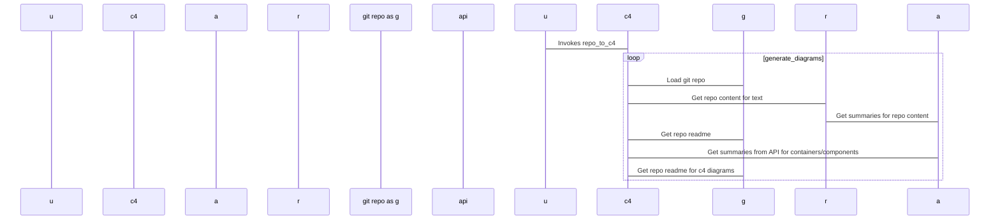

```mermaid
sequenceDiagram
participant user as u
participant repo_to_c4 as c4
participant api_to_test_code as a
participant repo_to_text as r
participant git repo as g
participant api as api

u->c4: Invokes repo_to_c4

loop generate_diagrams
    c4->g: Load git repo
    c4->r: Get repo content for text
    r->a: Get summaries for repo content
    c4->g: Get repo readme
    a->c4: Get summaries from API for containers/components
    c4->g: Get repo readme for c4 diagrams
end
```