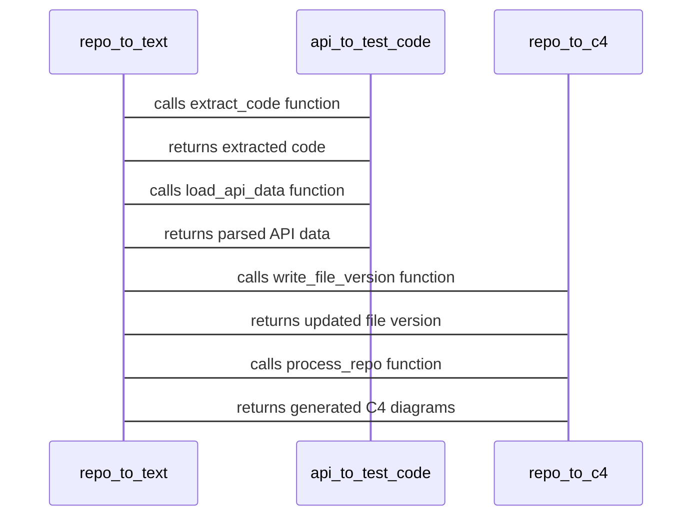

```mermaid
sequenceDiagram
participant repo_to_text
participant api_to_test_code
participant repo_to_c4
repo_to_text->api_to_test_code: calls extract_code function
api_to_test_code->repo_to_text: returns extracted code
repo_to_text->api_to_test_code: calls load_api_data function
api_to_test_code->repo_to_text: returns parsed API data
repo_to_text->repo_to_c4: calls write_file_version function
repo_to_c4->repo_to_text: returns updated file version
repo_to_text->repo_to_c4: calls process_repo function
repo_to_c4->repo_to_text: returns generated C4 diagrams
```