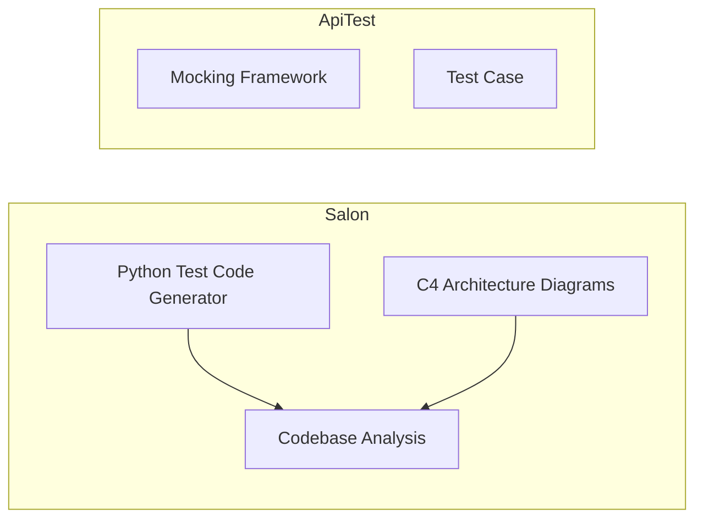

```mermaid
graph LR
subgraph Salon
    api_to_test_code["API Test Code Generation"] --> repo_to_text["Codebase Analysis"]
    repo_to_c4["C4 Architecture Diagrams"] --> repo_to_text
end

subgraph ApiTest
    UnitTest.mock["Mocking Framework"]
    PagerepositoryApi.Types_test.py["Test Case"]
    api_to_test_code["Python Test Code Generator"]
end
```