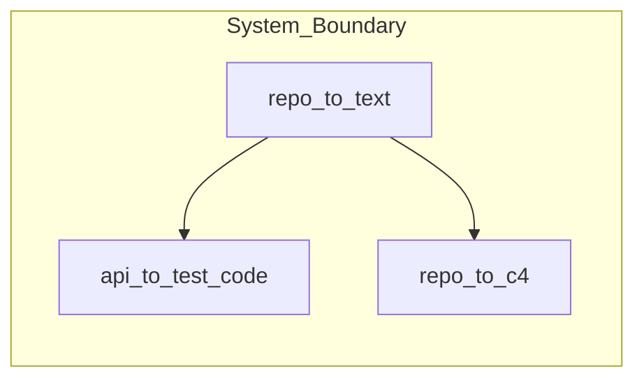

```mermaid
graph LR;

subgraph System_Boundary
    api_to_test_code
    repo_to_text
end

subgraph System_Boundary
    repo_to_c4
end

repo_to_text --> api_to_test_code
repo_to_text --> repo_to_c4
```