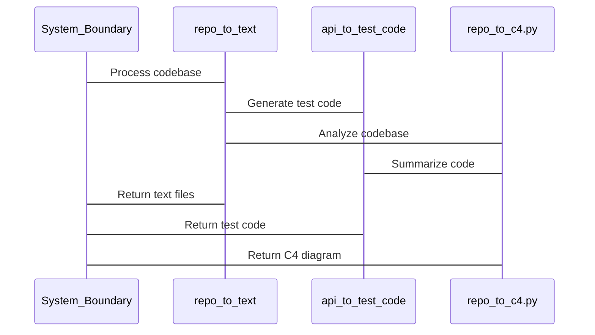

```mermaid
sequenceDiagram
participant System_Boundary
participant repo_to_text
participant api_to_test_code
participant repo_to_c4.py
System_Boundary->repo_to_text: Process codebase
repo_to_text->api_to_test_code: Generate test code
repo_to_c4.py->repo_to_text: Analyze codebase
repo_to_c4.py->api_to_test_code: Summarize code
repo_to_text->System_Boundary: Return text files
api_to_test_code->System_Boundary: Return test code
repo_to_c4.py->System_Boundary: Return C4 diagram
```