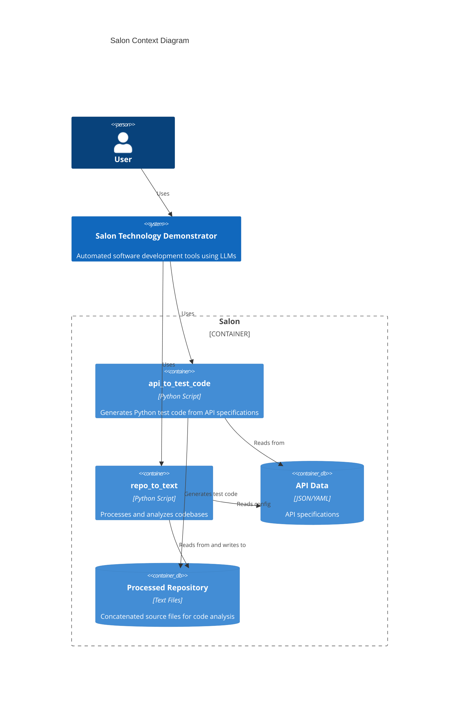

```mermaid
C4Context
    title Salon Context Diagram

    Person(User, "User")

    System(Salon, "Salon Technology Demonstrator", "Automated software development tools using LLMs")

    Container_Boundary(Salon_Boundary, "Salon") {
        Container(api_to_test_code, "api_to_test_code", "Python Script", "Generates Python test code from API specifications")
        Container(repo_to_text, "repo_to_text", "Python Script", "Processes and analyzes codebases")

        ContainerDb(api_data, "API Data", "JSON/YAML", "API specifications")
        ContainerDb(processed_repo, "Processed Repository", "Text Files", "Concatenated source files for code analysis")
    }

    Rel(User, Salon, "Uses")
    Rel(Salon, api_to_test_code, "Uses")
    Rel(api_to_test_code, api_data, "Reads from")
    Rel(api_to_test_code, processed_repo, "Generates test code")
    Rel(Salon, repo_to_text, "Uses")
    Rel(repo_to_text, processed_repo, "Reads from and writes to")
    Rel(repo_to_text, api_data, "Reads config")
```
