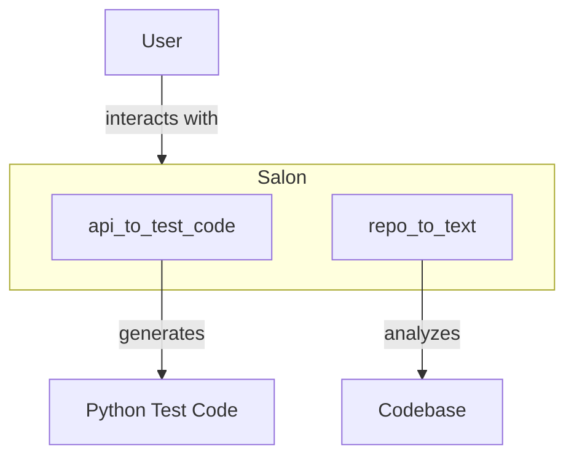

```mermaid
graph TD
    User["User"] -->|interacts with| Salon["Salon"]
    subgraph Salon
        api_to_test_code["api_to_test_code"]
        repo_to_text["repo_to_text"]
    end
    api_to_test_code -->|generates| Python_Test_Code["Python Test Code"]
    repo_to_text -->|analyzes| Codebase["Codebase"]
```
