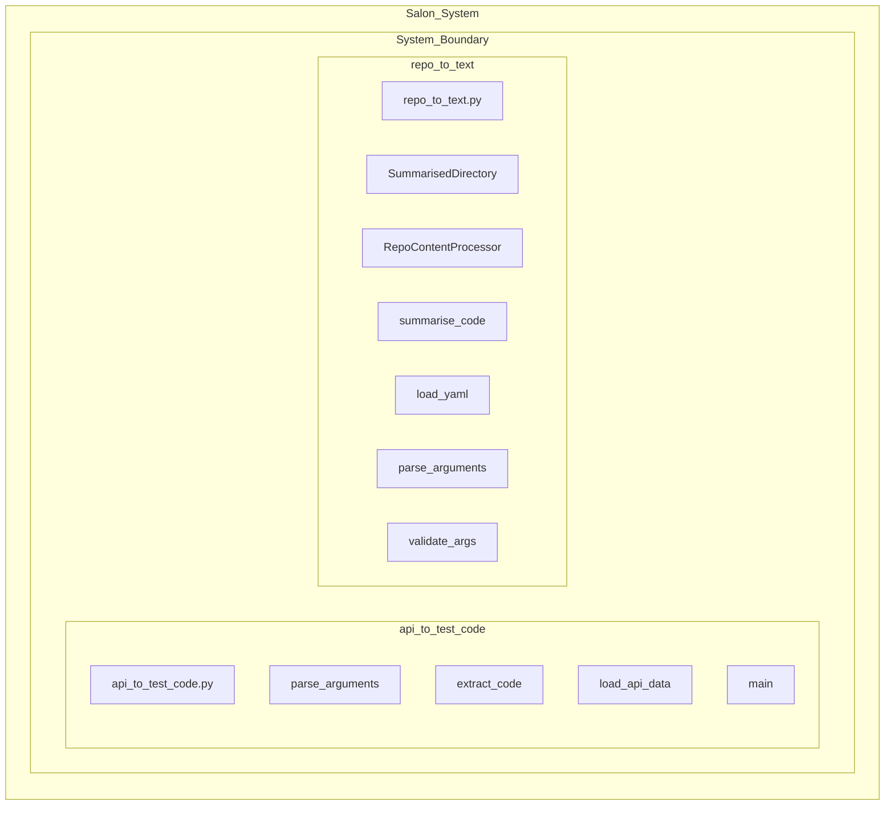

```mermaid
flowchart TD
    subgraph Salon_System
        direction TB
        subgraph System_Boundary
            subgraph api_to_test_code
                A[api_to_test_code.py]
                B[parse_arguments]
                C[extract_code]
                D[load_api_data]
                E[main]
            end

            subgraph repo_to_text
                F[repo_to_text.py]
                G[SummarisedDirectory]
                H[RepoContentProcessor]
                I[summarise_code]
                J[load_yaml]
                K[parse_arguments]
                L[validate_args]
            end
        end
    end
```