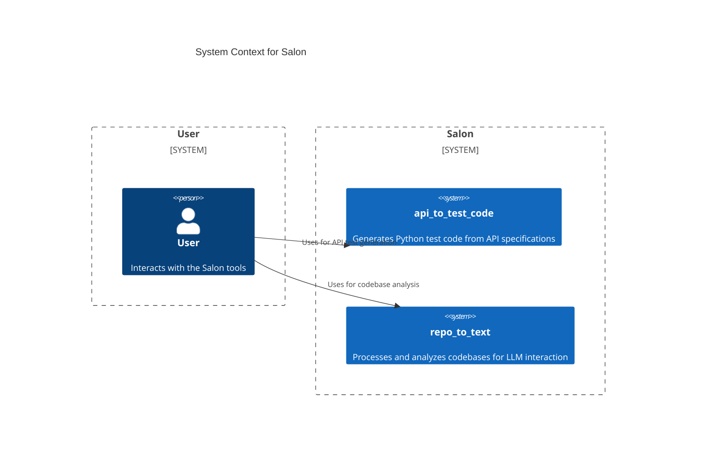

```mermaid
C4Context
title System Context for Salon

System_Boundary(u0, "User") {
    Person(user, "User", "Interacts with the Salon tools")
}

System_Boundary(s1, "Salon") {
    System(api_to_test_code, "api_to_test_code", "Generates Python test code from API specifications")
    System(repo_to_text, "repo_to_text", "Processes and analyzes codebases for LLM interaction")
}

Rel(user, api_to_test_code, "Uses for API test generation")
Rel(user, repo_to_text, "Uses for codebase analysis")
```