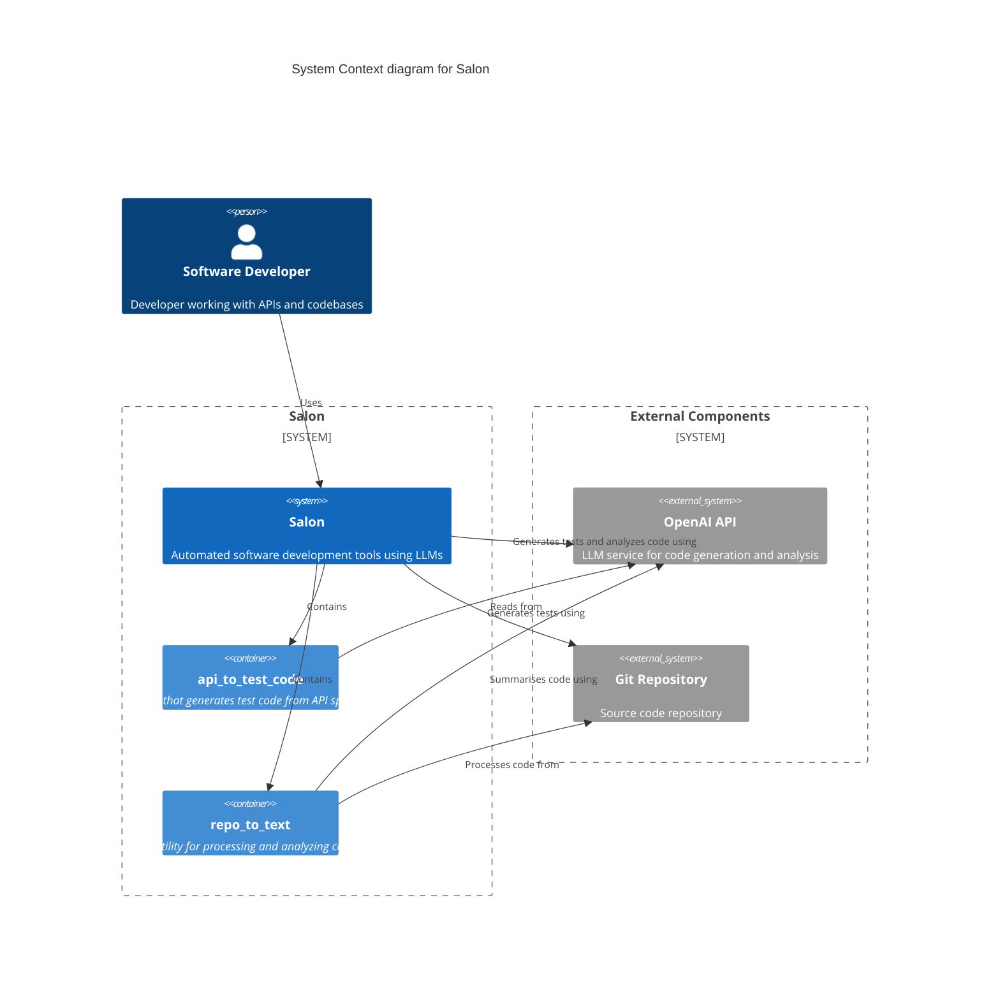

```mermaid
C4Context
title System Context diagram for Salon

Person(developer, "Software Developer", "Developer working with APIs and codebases")

System_Boundary(salon, "Salon") {
    System(salon, "Salon", "Automated software development tools using LLMs")
    Container(api_to_test, "api_to_test_code", "Python tool that generates test code from API specifications")
    Container(repo_to_text, "repo_to_text", "Python utility for processing and analyzing codebases")    
}

System_Boundary(External, "External Components") {  
    System_Ext(openai, "OpenAI API", "LLM service for code generation and analysis")
    System_Ext(git, "Git Repository", "Source code repository")
}

Rel(developer, salon, "Uses")
Rel(salon, openai, "Generates tests and analyzes code using")
Rel(salon, git, "Reads from")


Rel(salon, api_to_test, "Contains")
Rel(salon, repo_to_text, "Contains")
Rel(api_to_test, openai, "Generates tests using")
Rel(repo_to_text, git, "Processes code from")
Rel(repo_to_text, openai, "Summarises code using")
```