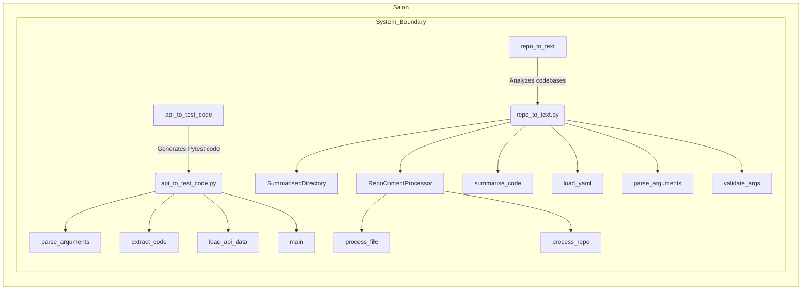

```mermaid
flowchart TD
    subgraph Salon
        direction TB
        
        subgraph System_Boundary
            direction TB
            
            api_to_test_code[api_to_test_code]
            repo_to_text[repo_to_text]
            
            api_to_test_code --> |"Generates Pytest code"| api_to_test_code_py(api_to_test_code.py)
            
            parse_arguments_1[parse_arguments]
            extract_code[extract_code]
            load_api_data[load_api_data]
            main_1[main]
            
            api_to_test_code_py --> parse_arguments_1
            api_to_test_code_py --> extract_code
            api_to_test_code_py --> load_api_data
            api_to_test_code_py --> main_1
            
            repo_to_text --> |"Analyzes codebases"| repo_to_text_py(repo_to_text.py)
            
            SummarisedDirectory[SummarisedDirectory]
            RepoContentProcessor[RepoContentProcessor]
            summarise_code[summarise_code]
            load_yaml[load_yaml]
            parse_arguments_2[parse_arguments]
            validate_args[validate_args]
            
            repo_to_text_py --> SummarisedDirectory
            repo_to_text_py --> RepoContentProcessor
            repo_to_text_py --> summarise_code
            repo_to_text_py --> load_yaml
            repo_to_text_py --> parse_arguments_2
            repo_to_text_py --> validate_args
            
            process_individual_file[process_file]
            process_repo_step[process_repo]
            
            RepoContentProcessor --> process_individual_file
            RepoContentProcessor --> process_repo_step
        end
    end
```
