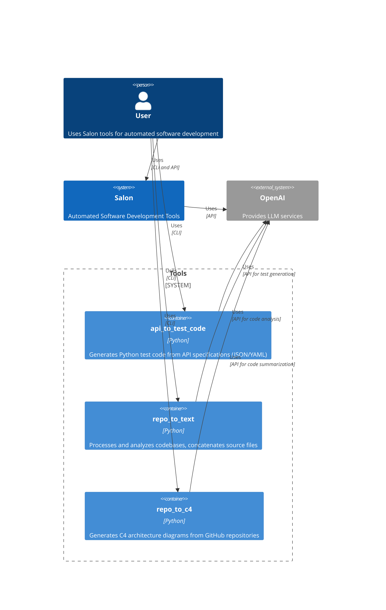

```mermaid
C4Context
  Person(user, "User", "Uses Salon tools for automated software development")
  System(salon, "Salon", "Automated Software Development Tools")

  Rel(user, salon, "Uses", "CLI and API")

  System_Ext(openai, "OpenAI", "Provides LLM services")

  Rel(salon, openai, "Uses", "API")

  System_Boundary(tools, "Tools") {
    Container(api_to_test_code, "api_to_test_code", "Python", "Generates Python test code from API specifications (JSON/YAML)")
    Container(repo_to_text, "repo_to_text", "Python", "Processes and analyzes codebases, concatenates source files")
    Container(repo_to_c4, "repo_to_c4", "Python", "Generates C4 architecture diagrams from GitHub repositories")
  }

  Rel(user, api_to_test_code, "Uses", "CLI")
  Rel(user, repo_to_text, "Uses", "CLI")
  Rel(user, repo_to_c4, "Uses", "CLI")

  Rel(api_to_test_code, openai, "Uses", "API for test generation")
  Rel(repo_to_text, openai, "Uses", "API for code analysis")
  Rel(repo_to_c4, openai, "Uses", "API for code summarization")

```
