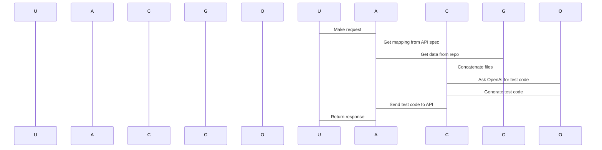

```mermaid
sequenceDiagram
participant User as U
participant API as A
participant Code as C
participant GitHub as G
participant OpenAI as O

U->A: Make request
A->C: Get mapping from API spec
A->G: Get data from repo
G->C: Concatenate files
C->O: Ask OpenAI for test code
O->C: Generate test code
C->A: Send test code to API
A->U: Return response
```