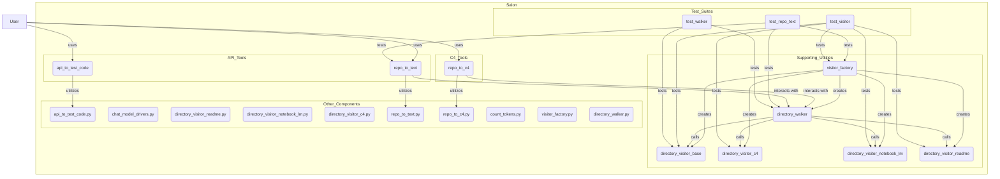

```mermaid
flowchart TB
    %% System boundaries
    subgraph Salon
        subgraph API_Tools
            A1(api_to_test_code)
            A2(repo_to_text)
        end
        
        subgraph C4_Tools
            C1(repo_to_c4)
        end

        subgraph Supporting_Utilities
            SU1(directory_visitor_base)
            SU2(directory_visitor_c4)
            SU3(directory_visitor_notebook_lm)
            SU4(directory_visitor_readme)
            SU5(directory_walker)
            SU6(visitor_factory)
        end

        subgraph Test_Suites
            TS1(test_repo_text)
            TS2(test_visitor)
            TS3(test_walker)
        end

        subgraph Other_Components
            OC1(api_to_test_code.py)
            OC2(chat_model_drivers.py)
            OC3(directory_visitor_readme.py)
            OC4(directory_visitor_notebook_lm.py)
            OC5(directory_visitor_c4.py)
            OC6(repo_to_text.py)
            OC7(repo_to_c4.py)
            OC8(count_tokens.py)
            OC9(visitor_factory.py)
            OC10(directory_walker.py)
        end
    end

    %% Links
    User -- uses --> A1
    User -- uses --> A2
    User -- uses --> C1
    A1 -- utilizes --> OC1
    A2 -- utilizes --> OC6
    C1 -- utilizes --> OC7
    SU6 -- creates --> SU1
    SU6 -- creates --> SU2
    SU6 -- creates --> SU3
    SU6 -- creates --> SU4
    SU6 -- creates --> SU5
    C1 -- interacts with --> SU5
    A2 -- interacts with --> SU5
    SU5 -- calls --> SU1
    SU5 -- calls --> SU2
    SU5 -- calls --> SU3
    SU5 -- calls --> SU4
    TS1 -- tests --> A2
    TS1 -- tests --> SU5
    TS1 -- tests --> SU6
    TS2 -- tests --> SU1
    TS2 -- tests --> SU2
    TS2 -- tests --> SU3
    TS2 -- tests --> SU4
    TS2 -- tests --> SU6
    TS3 -- tests --> SU5
    TS3 -- tests --> SU1
```
