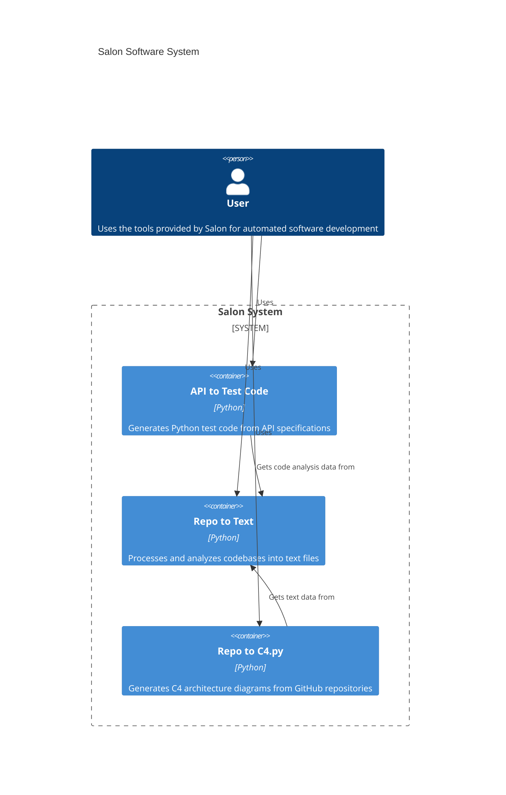

```mermaid
C4Context
title Salon Software System

Person(user, "User", "Uses the tools provided by Salon for automated software development")

System_Boundary(salon, "Salon System") {
    Container(api_to_test_code, "API to Test Code", "Python", "Generates Python test code from API specifications")
    Container(repo_to_text, "Repo to Text", "Python", "Processes and analyzes codebases into text files")
    Container(repo_to_c4, "Repo to C4.py", "Python", "Generates C4 architecture diagrams from GitHub repositories")
}

Rel(user, api_to_test_code, "Uses")
Rel(user, repo_to_text, "Uses")
Rel(user, repo_to_c4, "Uses")
Rel(api_to_test_code, repo_to_text, "Gets code analysis data from")
Rel(repo_to_c4, repo_to_text, "Gets text data from")

```