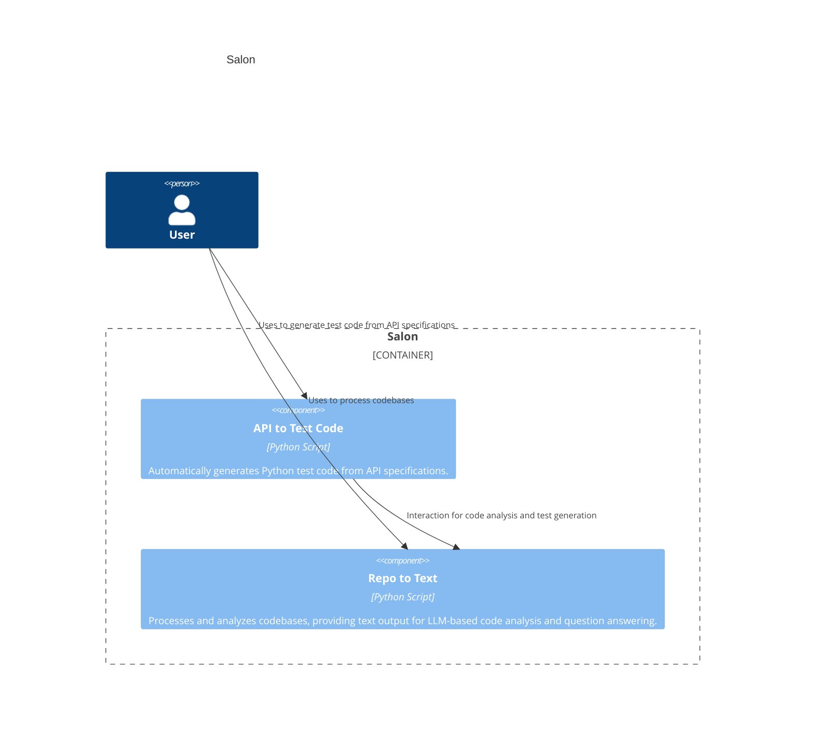

```markdown

```mermaid
C4Context
title Salon

Person(customer, "User")

Container_Boundary(c1, "Salon") {
    Component(api_to_test_code, "API to Test Code", "Python Script", "Automatically generates Python test code from API specifications.")
    Component(repo_to_text, "Repo to Text", "Python Script", "Processes and analyzes codebases, providing text output for LLM-based code analysis and question answering.")
}

Rel(customer, api_to_test_code, "Uses to generate test code from API specifications")
Rel(customer, repo_to_text, "Uses to process codebases")

Rel(api_to_test_code, repo_to_text, "Interaction for code analysis and test generation")
```
```
```