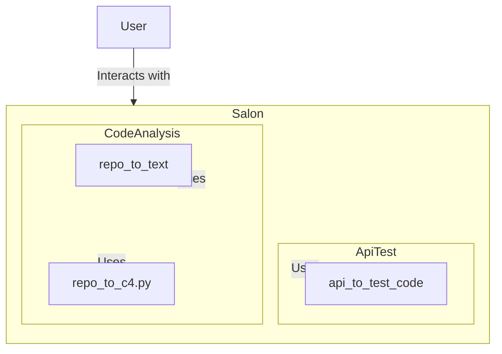

```mermaid
flowchart TB
    A[User]
    subgraph Salon
        subgraph ApiTest
            B[api_to_test_code]
        end
        subgraph CodeAnalysis
            C[repo_to_text]
            D[repo_to_c4.py]
        end
    end

    A -->|Interacts with| Salon
    Salon -.->|Uses| B
    Salon -.->|Uses| C
    Salon -.->|Uses| D
```