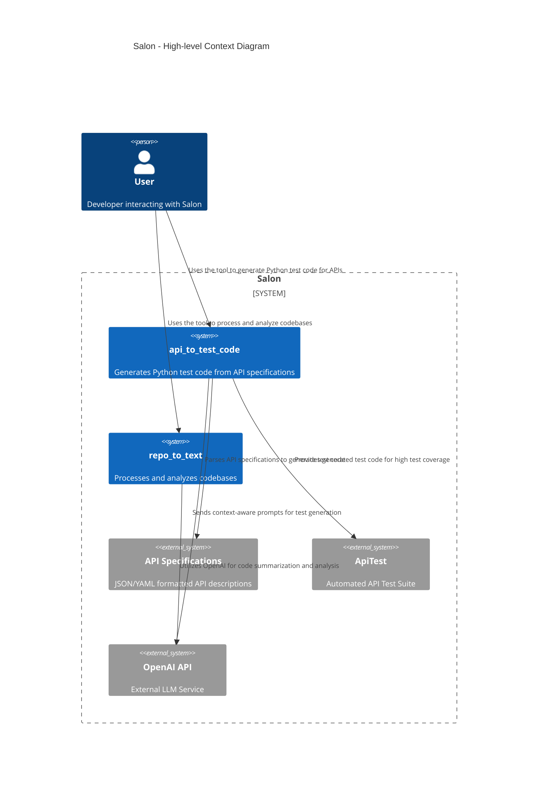

```mermaid
C4Context
    title Salon - High-level Context Diagram

    Person(user, "User", "Developer interacting with Salon")

    System_Boundary(salon, "Salon") {
        System(api_to_test_code, "api_to_test_code", "Generates Python test code from API specifications")
        System(repo_to_text, "repo_to_text", "Processes and analyzes codebases")

        System_Ext(api_spec, "API Specifications", "JSON/YAML formatted API descriptions")
        System_Ext(apiTest, "ApiTest", "Automated API Test Suite")
        System_Ext(openai, "OpenAI API", "External LLM Service")
    }

    Rel(user, api_to_test_code, "Uses the tool to generate Python test code for APIs")
    Rel(api_to_test_code, api_spec, "Parses API specifications to generate test code")
    Rel(api_to_test_code, apiTest, "Provides generated test code for high test coverage")
    Rel(api_to_test_code, openai, "Sends context-aware prompts for test generation")
    
    Rel(user, repo_to_text, "Uses the tool to process and analyze codebases")
    Rel(repo_to_text, openai, "Utilizes OpenAI for code summarization and analysis")
```