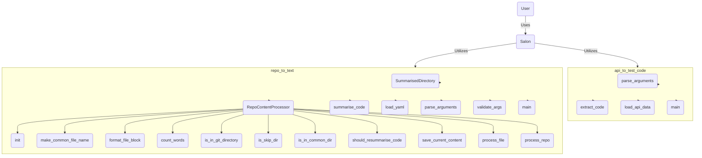

```mermaid
flowchart TB
  User("User")
  Salon("Salon")

  subgraph api_to_test_code
    A1("parse_arguments")
    A2("extract_code")
    A3("load_api_data")
    A4("main")
  end

  subgraph repo_to_text
    R1("SummarisedDirectory")
    R2("RepoContentProcessor")
    R2_1("init")
    R2_2("make_common_file_name")
    R2_3("format_file_block")
    R2_4("count_words")
    R2_5("is_in_git_directory")
    R2_6("is_skip_dir")
    R2_7("is_in_common_dir")
    R2_8("should_resummarise_code")
    R2_9("save_current_content")
    R2_10("process_file")
    R2_11("process_repo")
    R3("summarise_code")
    R4("load_yaml")
    R5("parse_arguments")
    R6("validate_args")
    R7("main")
  end

  User -->|Uses| Salon
  Salon -->|Utilizes| api_to_test_code
  Salon -->|Utilizes| repo_to_text
  
  api_to_test_code --> A1
  api_to_test_code --> A2
  api_to_test_code --> A3
  api_to_test_code --> A4

  repo_to_text --> R1
  repo_to_text --> R2
  R2 --> R2_1
  R2 --> R2_2
  R2 --> R2_3
  R2 --> R2_4
  R2 --> R2_5
  R2 --> R2_6
  R2 --> R2_7
  R2 --> R2_8
  R2 --> R2_9
  R2 --> R2_10
  R2 --> R2_11
  repo_to_text --> R3
  repo_to_text --> R4
  repo_to_text --> R5
  repo_to_text --> R6
  repo_to_text --> R7
```