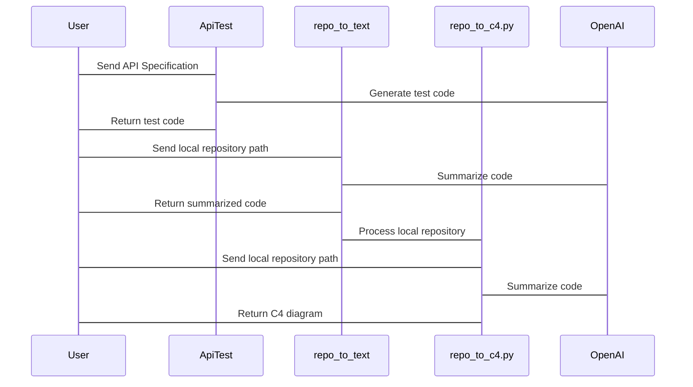

```mermaid
sequenceDiagram
participant User
participant ApiTest
participant repo_to_text
participant repo_to_c4.py
participant OpenAI
User->ApiTest: Send API Specification
ApiTest->OpenAI: Generate test code
ApiTest->User: Return test code
User->repo_to_text: Send local repository path
repo_to_text->OpenAI: Summarize code
repo_to_text->User: Return summarized code
repo_to_c4.py->repo_to_text: Process local repository
User->repo_to_c4.py: Send local repository path
repo_to_c4.py->OpenAI: Summarize code
repo_to_c4.py->User: Return C4 diagram
```