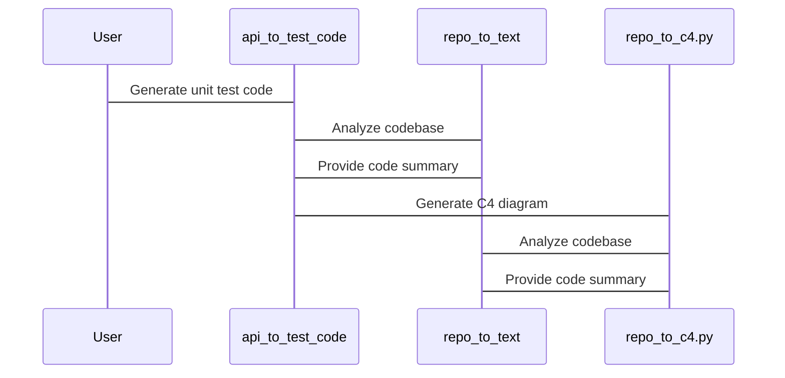

```mermaid
sequenceDiagram

User -> api_to_test_code: Generate unit test code
api_to_test_code -> repo_to_text: Analyze codebase
repo_to_text -> api_to_test_code: Provide code summary
api_to_test_code -> repo_to_c4.py: Generate C4 diagram
repo_to_c4.py -> repo_to_text: Analyze codebase
repo_to_text -> repo_to_c4.py: Provide code summary
```