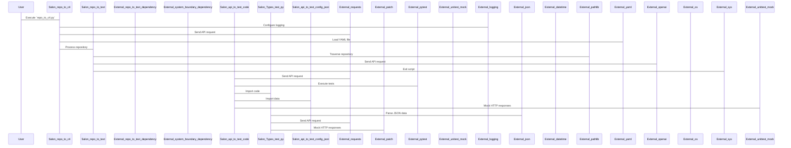

```mermaid
sequenceDiagram
participant User
participant Salon_repo_to_c4
participant Salon_repo_to_text
participant External_repo_to_text_dependency
participant External_system_boundary_dependency
participant Salon_api_to_test_code
participant Salon_Types_test_py
participant Salon_api_to_test_config_json
participant External_requests
participant External_patch
participant External_pytest
participant External_unitest_mock
participant External_logging
participant External_json
participant External_datetime
participant External_pathlib
participant External_yaml
participant External_openai
participant External_os
participant External_sys

User->Salon_repo_to_c4: Execute `repo_to_c4.py`

Salon_repo_to_c4->External_logging: Configure logging

Salon_repo_to_c4->External_requests: Send API request

Salon_repo_to_c4->External_yaml: Load YAML file

Salon_repo_to_c4->Salon_repo_to_text: Process repository

Salon_repo_to_text->External_pathlib: Traverse repository

Salon_repo_to_text->External_openai: Send API request

Salon_repo_to_text->External_sys: Exit script

Salon_api_to_test_code->External_requests: Send API request

Salon_api_to_test_code->External_pytest: Execute tests

Salon_api_to_test_code->Salon_Types_test_py: Import code

Salon_api_to_test_code->Salon_api_to_test_config_json: Import data

Salon_api_to_test_code->External_unittest_mock: Mock HTTP responses

Salon_Types_test_py->External_json: Parse JSON data

Salon_Types_test_py->External_requests: Send API request

Salon_Types_test_py->External_patch: Mock HTTP responses
```