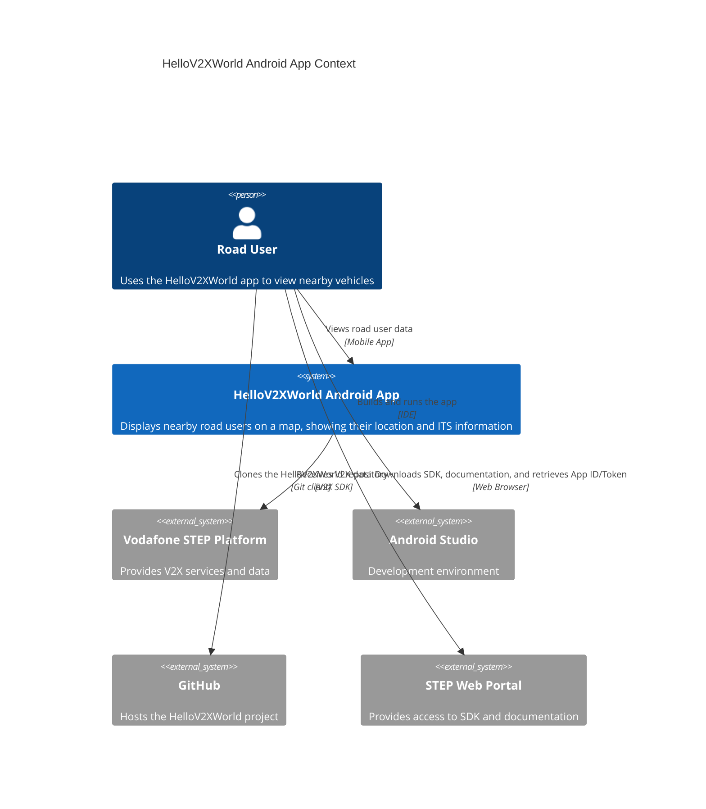
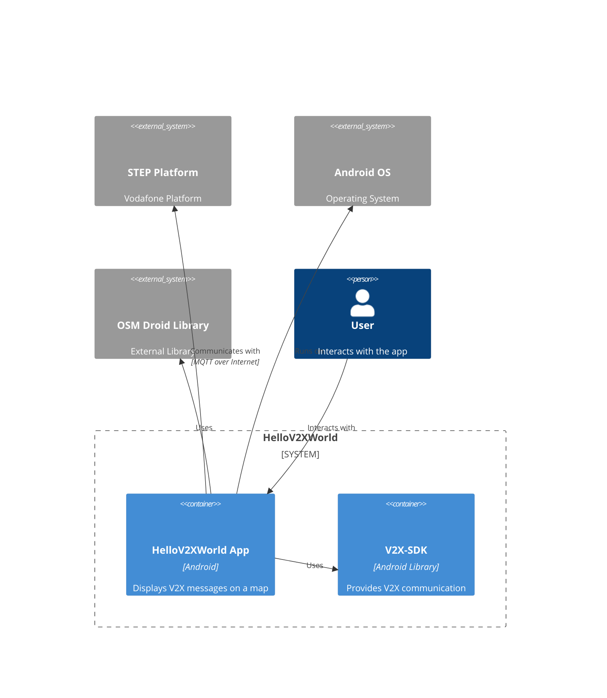
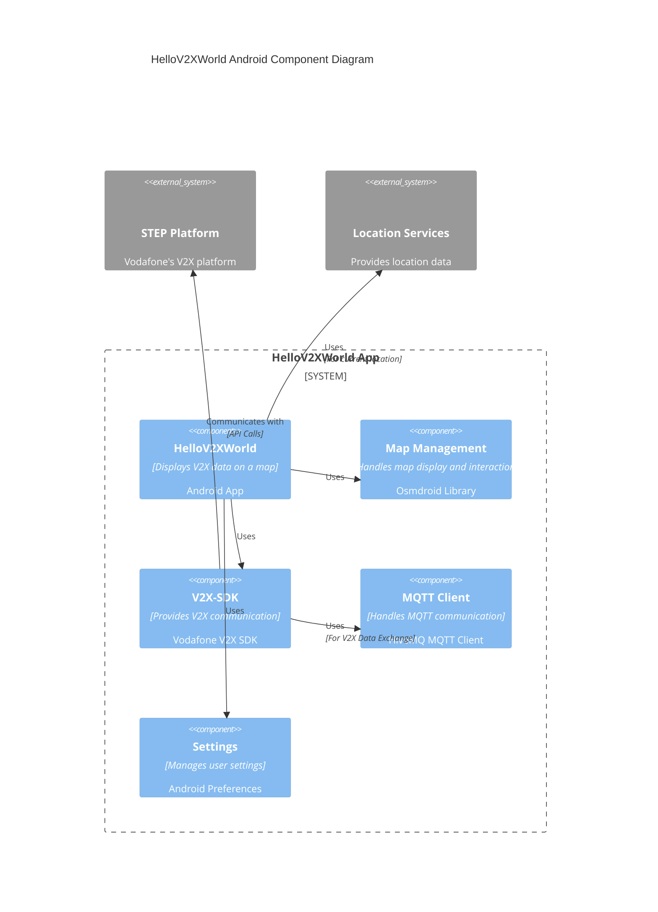

# Vodafone Guide: Repository Architecture Visualization 

This guide helps you generate C4 architecture diagrams for your repositories using Salon's automated documentation tools.

## Prerequisites

- Python 3.8+
- Git
- Google Developer API key (Gemini Pro 1.5)
- Required Python packages:
  ```bash
  pip install google-generativeai pyyaml nltk requests
  ```

## Initial Setup

1. **Clone Salon Tool**
   ```bash
   git clone https://github.com/BraidTechnologies/Studio.git
   cd Studio
   ```

2. **Configure Environment Variables**

   For Vodafone's Corporate Network:
   ```bash
   # Gemini API Configuration
   export GOOGLE_DEVELOPER_API_KEY="your_gemini_api_key"
   
   # Vodafone Proxy Settings
   export HTTP_PROXY="http://vodafone-proxy.internal:8080"
   export HTTPS_PROXY="http://vodafone-proxy.internal:8080"
   export NO_PROXY="localhost,127.0.0.1"

   Update the proxy settings in the `Salon/src/models/gemini.py` file to ensure proper configuration for Vodafone's corporate network. The relevant section should look like this:
   
   ```python
   # Get proxy from environment variable
   proxy = os.environ.get('HTTPS_PROXY', None)  # Use HTTPS_PROXY for secure connections
   ```
   ```

3. **Create Configuration File**
   
   Create `vodafone_config.yaml`:
   ```yaml
   model_type: "local_gemini"  # Use Gemini instead of OpenAI
   
   skip_dirs:
     - "node_modules"
     - ".git"
     - "venv"
     - "__pycache__"
     - "dist"
   
   skip_patterns:
     - "*.pyc"
     - "*.git*"
     - "*.env"
     - "*.log"
   
   source_patterns:
     - "*.py"
     - "*.java"
     - "*.ts"
     - "*.cs"
     - "*.go"
   ```

## Processing Your Repository

1. **Clone Target Repository**
   ```bash
   git clone https://github.com/vodafone/your-target-repo.git
   cd your-target-repo
   ```

2. **Generate Text Summaries**
   ```bash
   python -m Salon.src.repo_to_text \
     --cfg "C:\\Repo\\Studio\\Salon\\vodafone_config.yaml" \
     --repo_path "C:\\Repo\\Studio\\" \
     --output_dir "C:\\Repo\\Studio\\output\\" \
     --model_type local_gemini
   ```

3. **Generate C4 Diagrams**
   ```bash
   python -m Salon.src.repo_to_c4 \
     --repo_path "C:\\Repo\\Studio\\" \
     --model_type local_gemini
   ```

## Output Files

The tool generates several Markdown files containing Mermaid C4 diagrams:
- `C4Context.Salon.md`: System context diagram
- `C4Container.Salon.md`: Container diagram
- `C4Component.Salon.md`: Component diagram

## Gemini Model Configuration

The tool uses Gemini Pro 1.5 for code analysis. Key features:
- Proxy-aware API calls
- Automatic retries on failure
- Configurable response length
- Corporate network compatibility


## Example C4 Diagrams

1. **Context Diagram**


2. **Container Diagram**

3. **Component Diagram**
