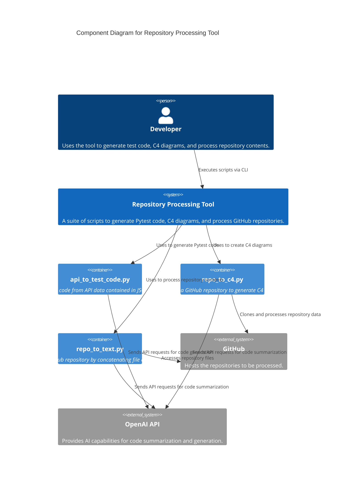

```mermaid
C4Component
title Component Diagram for Repository Processing Tool
Person(user, "Developer", "Uses the tool to generate test code, C4 diagrams, and process repository contents.")
System(repoProcessingTool, "Repository Processing Tool", "A suite of scripts to generate Pytest code, C4 diagrams, and process GitHub repositories.")
Container(api_to_test_code, "api_to_test_code.py", "Generates Pytest code from API data contained in JSON or YAML files.")
Container(repo_to_c4, "repo_to_c4.py", "Processes a GitHub repository to generate C4 diagrams.")
Container(repo_to_text, "repo_to_text.py", "Processes a local GitHub repository by concatenating file contents into text files.")
System_Ext(github, "GitHub", "Hosts the repositories to be processed.")
System_Ext(openai, "OpenAI API", "Provides AI capabilities for code summarization and generation.")
Rel(user, repoProcessingTool, "Executes scripts via CLI")
Rel(repoProcessingTool, api_to_test_code, "Uses to generate Pytest code")
Rel(repoProcessingTool, repo_to_c4, "Uses to create C4 diagrams")
Rel(repoProcessingTool, repo_to_text, "Uses to process repository contents")
Rel(api_to_test_code, openai, "Sends API requests for code generation")
Rel(repo_to_c4, github, "Clones and processes repository data")
Rel(repo_to_c4, openai, "Sends API requests for code summarization")
Rel(repo_to_text, github, "Accesses repository files")
Rel(repo_to_text, openai, "Sends API requests for code summarization")
```