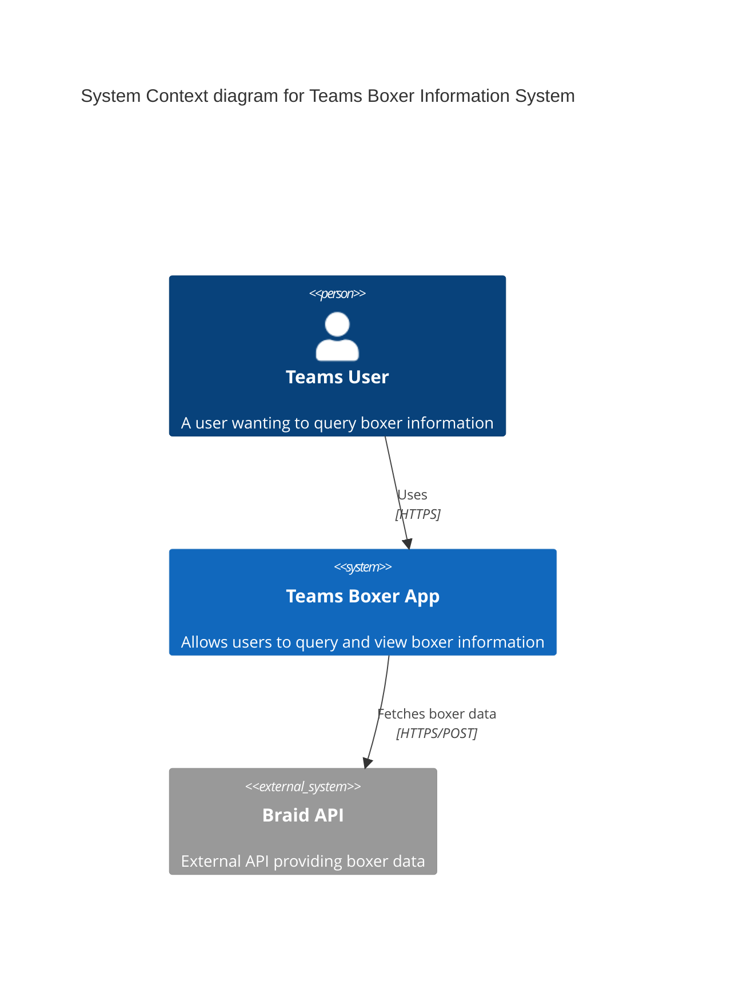

```mermaid
C4Context
title System Context diagram for Teams Boxer Information System

Person(user, "Teams User", "A user wanting to query boxer information")

System(teamsApp, "Teams Boxer App", "Allows users to query and view boxer information")

System_Ext(braidApi, "Braid API", "External API providing boxer data")

Rel(user, teamsApp, "Uses", "HTTPS")
Rel(teamsApp, braidApi, "Fetches boxer data", "HTTPS/POST")

```