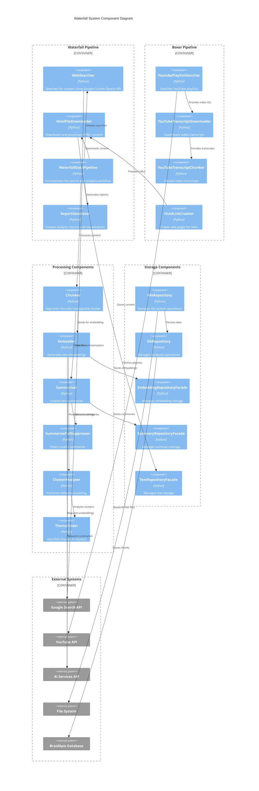

```mermaid
C4Component
title Waterfall System Component Diagram

Container_Boundary(waterfallPipeline, "Waterfall Pipeline") {
    Component(webSearcher, "WebSearcher", "Python", "Searches for content using Google Custom Search API")
    Component(htmlDownloader, "HtmlFileDownloader", "Python", "Downloads and processes HTML content")
    Component(pipelineOrchestrator, "WaterfallDataPipeline", "Python", "Orchestrates the search and analysis workflow")
    Component(reportGenerator, "ReportGenerator", "Python", "Creates analysis reports and visualizations")
}

Container_Boundary(boxerPipeline, "Boxer Pipeline") {
    Component(youtubeSearcher, "YoutubePlaylistSearcher", "Python", "Searches YouTube playlists")
    Component(transcriptDownloader, "YouTubeTranscriptDownloader", "Python", "Downloads video transcripts")
    Component(transcriptChunker, "YouTubeTranscriptChunker", "Python", "Chunks video transcripts")
    Component(htmlCrawler, "HtmlLinkCrawler", "Python", "Crawls web pages for links")
}

Container_Boundary(processingComponents, "Processing Components") {
    Component(chunkerComponent, "Chunker", "Python", "Segments text into manageable chunks")
    Component(embedderComponent, "Embedder", "Python", "Generates text embeddings")
    Component(summarizerComponent, "Summariser", "Python", "Creates text summaries")
    Component(failSuppressor, "SummariseFailSuppressor", "Python", "Filters invalid summaries")
    Component(clusterComponent, "ClusterAnalyser", "Python", "Performs KMeans clustering")
    Component(themeComponent, "ThemeFinder", "Python", "Identifies themes in clusters")
}

Container_Boundary(storage, "Storage Components") {
    Component(fileRepoComponent, "FileRepository", "Python", "Manages file system operations")
    Component(dbRepoComponent, "DbRepository", "Python", "Manages database operations")
    Component(embeddingRepo, "EmbeddingRepositoryFacade", "Python", "Manages embedding storage")
    Component(summaryRepo, "SummaryRepositoryFacade", "Python", "Manages summary storage")
    Component(textRepo, "TextRepositoryFacade", "Python", "Manages text storage")
}

Rel(pipelineOrchestrator, webSearcher, "Initiates searches")
Rel(pipelineOrchestrator, htmlDownloader, "Downloads content")
Rel(pipelineOrchestrator, reportGenerator, "Generates reports")

Rel(youtubeSearcher, transcriptDownloader, "Provides video IDs")
Rel(transcriptDownloader, transcriptChunker, "Provides transcripts")
Rel(htmlCrawler, htmlDownloader, "Provides URLs")

Rel(pipelineOrchestrator, chunkerComponent, "Processes content")
Rel(chunkerComponent, embedderComponent, "Sends for embedding")
Rel(chunkerComponent, summarizerComponent, "Sends for summarization")
Rel(summarizerComponent, failSuppressor, "Validates summaries")
Rel(embedderComponent, clusterComponent, "Provides embeddings")
Rel(clusterComponent, themeComponent, "Analyzes clusters")

Rel(embedderComponent, embeddingRepo, "Stores embeddings")
Rel(summarizerComponent, summaryRepo, "Stores summaries")
Rel(htmlDownloader, textRepo, "Stores content")
Rel(fileRepoComponent, dbRepoComponent, "Persists data")

Container_Boundary(external_systems, "External Systems") {
System_Ext(googleApi, "Google Search API")
System_Ext(youtubeApi, "YouTube API")
System_Ext(aiApi, "AI Services API")
System_Ext(filesystem, "File System")
System_Ext(database, "BraidApis Database")
}  

Rel(webSearcher, googleApi, "Searches")
Rel(youtubeSearcher, youtubeApi, "Fetches playlists")
Rel(embedderComponent, aiApi, "Requests embeddings")
Rel(summarizerComponent, aiApi, "Requests summaries")
Rel(fileRepoComponent, filesystem, "Reads/Writes files")
Rel(dbRepoComponent, database, "Stores chunks")
```