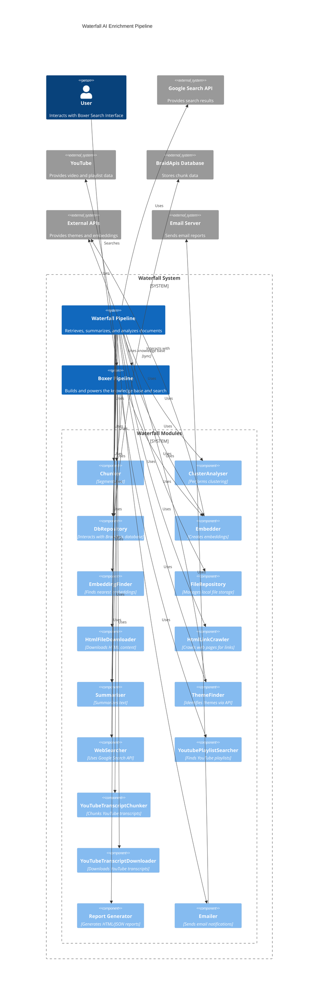

```mermaid
C4Context
title Waterfall AI Enrichment Pipeline

Person(user, "User", "Interacts with Boxer Search Interface")

System_Boundary(c1, "Waterfall System") {
    System(waterfall, "Waterfall Pipeline", "Retrieves, summarizes, and analyzes documents")
    System(boxer, "Boxer Pipeline", "Builds and powers the knowledge base and search")
    Rel(waterfall, boxer, "Uses knowledge base", "sync")


    System_Boundary(c2, "Waterfall Modules") {
        Component(chunker, "Chunker", "Segments text")
        Component(cluster_analyser, "ClusterAnalyser", "Performs clustering")
        Component(db_repository, "DbRepository", "Interacts with BraidApis database")
        Component(embedder, "Embedder", "Creates embeddings")
        Component(embedding_finder, "EmbeddingFinder", "Finds nearest embeddings")
        Component(file_repository, "FileRepository", "Manages local file storage")
        Component(html_file_downloader, "HtmlFileDownloader", "Downloads HTML content")
        Component(html_link_crawler, "HtmlLinkCrawler", "Crawls web pages for links")
        Component(summariser, "Summariser", "Summarizes text")
        Component(theme_finder, "ThemeFinder", "Identifies themes via API")
        Component(web_searcher, "WebSearcher", "Uses Google Search API")
        Component(youtube_playlist_searcher, "YoutubePlaylistSearcher", "Finds YouTube playlists")
        Component(youtube_transcript_chunker, "YouTubeTranscriptChunker", "Chunks YouTube transcripts")
        Component(youtube_transcript_downloader, "YouTubeTranscriptDownloader", "Downloads YouTube transcripts")
        Component(report_generator, "Report Generator", "Generates HTML/JSON reports")
        Component(emailer, "Emailer", "Sends email notifications")

        Rel(waterfall, chunker, "Uses", "")
        Rel(waterfall, cluster_analyser, "Uses", "")
        Rel(waterfall, db_repository, "Uses", "")
        Rel(waterfall, embedder, "Uses", "")
        Rel(waterfall, embedding_finder, "Uses", "")
        Rel(waterfall, file_repository, "Uses", "")
        Rel(waterfall, html_file_downloader, "Uses", "")
        Rel(waterfall, html_link_crawler, "Uses", "")
        Rel(waterfall, summariser, "Uses", "")
        Rel(waterfall, theme_finder, "Uses", "")
        Rel(waterfall, web_searcher, "Uses", "")


        Rel(boxer, youtube_playlist_searcher, "Uses", "")
        Rel(boxer, youtube_transcript_chunker, "Uses", "")
        Rel(boxer, youtube_transcript_downloader, "Uses", "")
        Rel(boxer, chunker, "Uses", "")
        Rel(boxer, summariser, "Uses", "")
        Rel(boxer, embedder, "Uses", "")
        Rel(boxer, db_repository, "Uses", "")

        Rel(waterfall, report_generator, "Uses", "")
        Rel(waterfall, emailer, "Uses", "")
    }
}

System_Ext(google_search, "Google Search API", "Provides search results")
System_Ext(youtube, "YouTube", "Provides video and playlist data")
System_Ext(braid_apis, "BraidApis Database", "Stores chunk data")
System_Ext(external_api, "External APIs", "Provides themes and embeddings")
System_Ext(email_server, "Email Server", "Sends email reports")


Rel(waterfall, google_search, "Uses", "")
Rel(boxer, youtube, "Uses", "")
Rel(db_repository, braid_apis, "Interacts with", "")
Rel(theme_finder, external_api, "Uses", "")
Rel(embedder, external_api, "Uses", "")
Rel(emailer, email_server, "Uses", "")
Rel(user, boxer, "Searches", "")

```