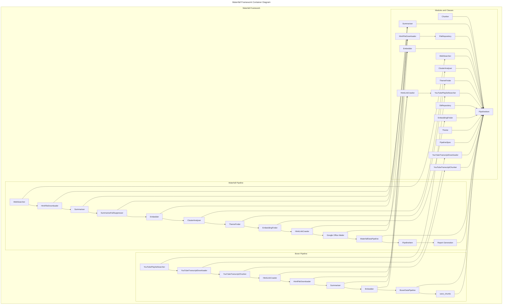

```mermaid
---
title: Waterfall Framework Container Diagram
---
graph TB
    subgraph Waterfall Framework
        subgraph Waterfall Pipeline
            WP1["WebSearcher"]
            WP2["HtmlFileDownloader"]
            WP3["Summariser"]
            WP4["SummariseFailSuppressor"]
            WP5["Embedder"]
            WP6["ClusterAnalyser"]
            WP7["ThemeFinder"]
            WP8["EmbeddingFinder"]
            WP9["HtmlLinkCrawler"]
            WP10["Google Office Mailer"]
            WP11["WaterfallDataPipeline"]
            WP12["PipelineItem"]
            WP13["Report Generation"]
        end
        
        subgraph Boxer Pipeline
            BP1["YouTubePlaylistSearcher"]
            BP2["YouTubeTranscriptDownloader"]
            BP3["YouTubeTranscriptChunker"]
            BP4["HtmlLinkCrawler"]
            BP5["HtmlFileDownloader"]
            BP6["Summariser"]
            BP7["Embedder"]
            BP8["BoxerDataPipeline"]
            BP9["save_chunks"]
        end
        
        subgraph Modules and Classes
            M1["Chunker"]
            M2["ClusterAnalyser"]
            M3["DbRepository"]
            M4["Embedder"]
            M5["EmbeddingFinder"]
            M6["FileRepository"]
            M7["HtmlFileDownloader"]
            M8["HtmlLinkCrawler"]
            M9["Summariser"]
            M10["ThemeFinder"]
            M11["WebSearcher"]
            M12["YouTubePlaylistSearcher"]
            M13["YouTubeTranscriptChunker"]
            M14["YouTubeTranscriptDownloader"]
            M15["PipelineItem"]
            M16["Theme"]
            M17["PipelineSpec"]
        end
    end
    
    WP1 --> WP2
    WP2 --> WP3
    WP3 --> WP4
    WP4 --> WP5
    WP5 --> WP6
    WP6 --> WP7
    WP7 --> WP8
    WP8 --> WP9
    WP9 --> WP10
    WP10 --> WP11
    WP11 --> WP12
    WP12 --> WP13

    BP1 --> BP2
    BP2 --> BP3
    BP3 --> BP4
    BP4 --> BP5
    BP5 --> BP6
    BP6 --> BP7
    BP7 --> BP8
    BP8 --> BP9
    
    WP1 --> M11
    WP2 --> M7
    WP3 --> M9
    WP4 --> M9
    WP5 --> M4
    WP6 --> M2
    WP7 --> M10
    WP8 --> M5
    WP9 --> M8
    WP10 --> M7
    WP11 --> M15
    WP13 --> M15
    
    BP1 --> M12
    BP2 --> M14
    BP3 --> M13
    BP4 --> M8
    BP5 --> M7
    BP6 --> M9
    BP7 --> M4
    BP8 --> M15
    BP9 --> M15

    M1 --> M15
    M2 --> M15
    M3 --> M15
    M4 --> M15
    M5 --> M15
    M6 --> M15
    M7 --> M6
    M8 --> M12
    M9 --> M15
    M10 --> M15
    M11 --> M15
    M12 --> M15
    M13 --> M15
    M14 --> M15
    M16 --> M15
    M17 --> M15
```
