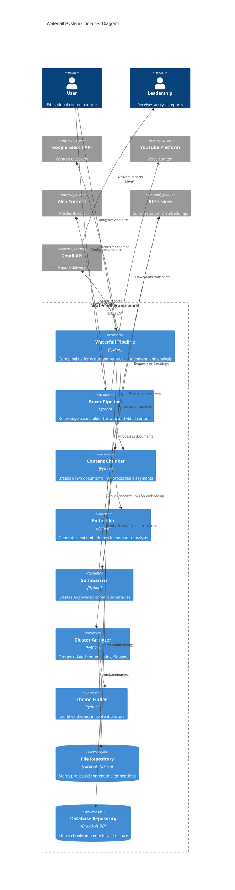

```mermaid
C4Container
title Waterfall System Container Diagram

Person(user, "User", "Educational content curator")
Person(leadership, "Leadership", "Receives analysis reports")

System_Boundary(waterfall, "Waterfall Framework") {
    Container(waterfallPipeline, "Waterfall Pipeline", "Python", "Core pipeline for document retrieval, enrichment, and analysis")
    Container(boxerPipeline, "Boxer Pipeline", "Python", "Knowledge base builder for web and video content")
    
    Container(chunker, "Content Chunker", "Python", "Breaks down documents into processable segments")
    Container(embedder, "Embedder", "Python", "Generates text embeddings for semantic analysis")
    Container(summarizer, "Summarizer", "Python", "Creates AI-powered content summaries")
    Container(clusterAnalyzer, "Cluster Analyzer", "Python", "Groups related content using KMeans")
    Container(themeFinder, "Theme Finder", "Python", "Identifies themes in content clusters")
    
    ContainerDb(fileRepo, "File Repository", "Local File System", "Stores processed content and embeddings")
    ContainerDb(dbRepo, "Database Repository", "BraidApis DB", "Stores chunks in hierarchical structure")
}

System_Ext(googleSearch, "Google Search API", "Content discovery")
System_Ext(youtube, "YouTube Platform", "Video content")
System_Ext(webContent, "Web Content", "Articles & docs")
System_Ext(aiApi, "AI Services", "Summarization & embeddings")
System_Ext(gmail, "Gmail API", "Report delivery")

Rel(user, waterfallPipeline, "Configures and runs")
Rel(user, boxerPipeline, "Configures and runs")

Rel(waterfallPipeline, googleSearch, "Searches for content")
Rel(boxerPipeline, youtube, "Downloads transcripts")
Rel(boxerPipeline, webContent, "Crawls content")

Rel(waterfallPipeline, chunker, "Processes documents")
Rel(boxerPipeline, chunker, "Processes documents")

Rel(chunker, embedder, "Sends chunks for embedding")
Rel(chunker, summarizer, "Sends chunks for summarization")

Rel(embedder, aiApi, "Requests embeddings")
Rel(summarizer, aiApi, "Requests summaries")

Rel(embedder, fileRepo, "Stores embeddings")
Rel(summarizer, fileRepo, "Stores summaries")
Rel(chunker, dbRepo, "Stores chunks")

Rel(waterfallPipeline, clusterAnalyzer, "Groups content")
Rel(clusterAnalyzer, themeFinder, "Analyzes clusters")

Rel(waterfallPipeline, gmail, "Sends reports", "Email")
Rel(gmail, leadership, "Delivers reports", "Email")
```
