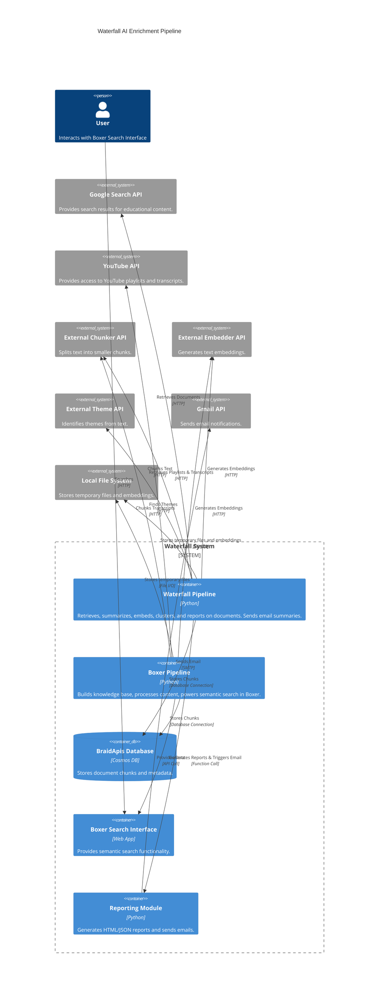

```mermaid
C4Context
title Waterfall AI Enrichment Pipeline

Person(user, "User", "Interacts with Boxer Search Interface")

System_Boundary(c1, "Waterfall System") {
  Container(waterfall_pipeline, "Waterfall Pipeline", "Python", "Retrieves, summarizes, embeds, clusters, and reports on documents. Sends email summaries.")
  Container(boxer_pipeline, "Boxer Pipeline", "Python", "Builds knowledge base, processes content, powers semantic search in Boxer.")
  ContainerDb(braid_apis_db, "BraidApis Database", "Cosmos DB", "Stores document chunks and metadata.")
  Container(boxer_search_interface, "Boxer Search Interface", "Web App", "Provides semantic search functionality.")
  Container(reporting_module, "Reporting Module", "Python", "Generates HTML/JSON reports and sends emails.")
}

System_Ext(google_search_api, "Google Search API", "Provides search results for educational content.")
System_Ext(youtube_api, "YouTube API", "Provides access to YouTube playlists and transcripts.")
System_Ext(external_chunker_api, "External Chunker API", "Splits text into smaller chunks.")
System_Ext(external_embedder_api, "External Embedder API", "Generates text embeddings.")
System_Ext(external_theme_api, "External Theme API", "Identifies themes from text.")
System_Ext(gmail_api, "Gmail API", "Sends email notifications.")
System_Ext(local_file_system, "Local File System", "Stores temporary files and embeddings.")


Rel(user, boxer_search_interface, "Searches", "HTTP")
Rel(waterfall_pipeline, google_search_api, "Retrieves Documents", "HTTP")
Rel(waterfall_pipeline, external_chunker_api, "Chunks Text", "HTTP")
Rel(waterfall_pipeline, external_embedder_api, "Generates Embeddings", "HTTP")
Rel(waterfall_pipeline, braid_apis_db, "Stores Chunks", "Database Connection")
Rel(waterfall_pipeline, reporting_module, "Generates Reports & Triggers Email", "Function Call")
Rel(reporting_module, gmail_api, "Sends Email", "SMTP")
Rel(boxer_pipeline, youtube_api, "Retrieves Playlists & Transcripts", "HTTP")
Rel(boxer_pipeline, external_chunker_api, "Chunks Transcripts", "HTTP")
Rel(boxer_pipeline, external_embedder_api, "Generates Embeddings", "HTTP")
Rel(boxer_pipeline, braid_apis_db, "Stores Chunks", "Database Connection")
Rel(boxer_pipeline, boxer_search_interface, "Provides Data", "API Call")
Rel(boxer_pipeline, local_file_system, "Stores temporary files", "File I/O")
Rel(waterfall_pipeline, local_file_system, "Stores temporary files and embeddings", "File I/O")
Rel(waterfall_pipeline, external_theme_api, "Finds Themes", "HTTP")


```
