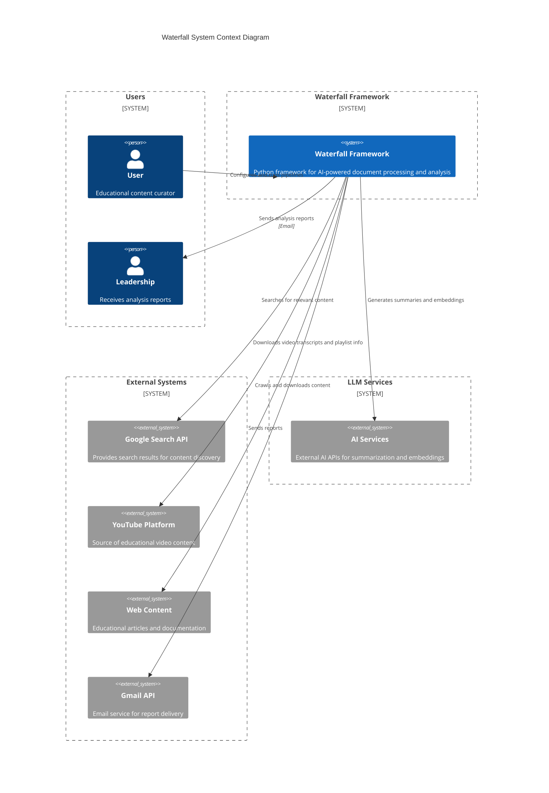

```mermaid
C4Context
title Waterfall System Context Diagram

System_Boundary(people, "Users") {
Person(user, "User", "Educational content curator")
Person(leadership, "Leadership", "Receives analysis reports")
}

System_Boundary(waterfall, "Waterfall Framework") {
System(waterfall, "Waterfall Framework", "Python framework for AI-powered document processing and analysis")
}

System_Boundary(external_systems, "External Systems") {
System_Ext(googleSearch, "Google Search API", "Provides search results for content discovery")
System_Ext(youtube, "YouTube Platform", "Source of educational video content")
System_Ext(webContent, "Web Content", "Educational articles and documentation")
System_Ext(gmail, "Gmail API", "Email service for report delivery")
}

System_Boundary(llm, "LLM Services") {
System_Ext(aiApi, "AI Services", "External AI APIs for summarization and embeddings")
}

Rel(user, waterfall, "Configures and runs pipelines")
Rel(waterfall, leadership, "Sends analysis reports", "Email")

Rel(waterfall, googleSearch, "Searches for relevant content")
Rel(waterfall, youtube, "Downloads video transcripts and playlist info")
Rel(waterfall, webContent, "Crawls and downloads content")
Rel(waterfall, aiApi, "Generates summaries and embeddings")
Rel(waterfall, gmail, "Sends reports")
```