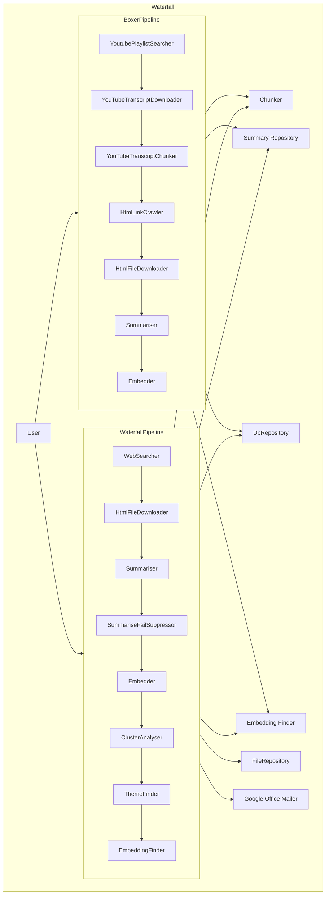

This diagram represents the context of the Waterfall framework and its main components. Each pipeline and module are grouped within their respective containers. Key interactions between users and the framework, as well as between components, are illustrated to provide a clear understanding of the system.