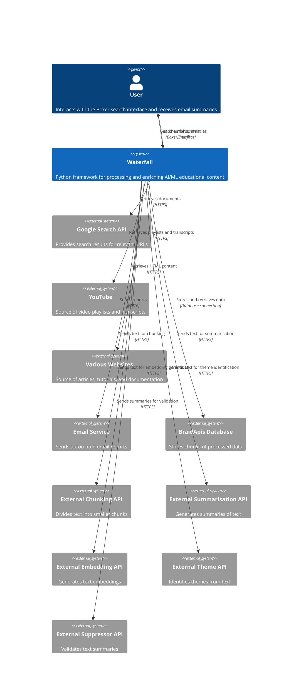

```mermaid
C4Context
  Person(user, "User", "Interacts with the Boxer search interface and receives email summaries")

  System(waterfall, "Waterfall", "Python framework for processing and enriching AI/ML educational content")

  Rel(user, waterfall, "Searches for content", "Boxer Interface")
  Rel(waterfall, user, "Sends email summaries", "Email")

  System_Ext(google_search, "Google Search API", "Provides search results for relevant URLs")
  Rel(waterfall, google_search, "Retrieves documents", "HTTPS")

  System_Ext(youtube, "YouTube", "Source of video playlists and transcripts")
  Rel(waterfall, youtube, "Retrieves playlists and transcripts", "HTTPS")

  System_Ext(web, "Various Websites", "Source of articles, tutorials, and documentation")
  Rel(waterfall, web, "Retrieves HTML content", "HTTPS")

  System_Ext(email_service, "Email Service", "Sends automated email reports")
  Rel(waterfall, email_service, "Sends reports", "SMTP")

  System_Ext(braid_apis, "BraidApis Database", "Stores chunks of processed data")
  Rel(waterfall, braid_apis, "Stores and retrieves data", "Database connection")

  System_Ext(external_api_chunker, "External Chunking API", "Divides text into smaller chunks")
  Rel(waterfall, external_api_chunker, "Sends text for chunking", "HTTPS")

  System_Ext(external_api_summariser, "External Summarisation API", "Generates summaries of text")
  Rel(waterfall, external_api_summariser, "Sends text for summarisation", "HTTPS")
  
  System_Ext(external_api_embedder, "External Embedding API", "Generates text embeddings")
  Rel(waterfall, external_api_embedder, "Sends text for embedding generation", "HTTPS")

  System_Ext(external_api_theme, "External Theme API", "Identifies themes from text")
  Rel(waterfall, external_api_theme, "Sends text for theme identification", "HTTPS")
  
  System_Ext(external_api_suppressor, "External Suppressor API", "Validates text summaries")
  Rel(waterfall, external_api_suppressor, "Sends summaries for validation", "HTTPS")


```
