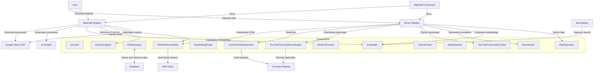

```mermaid
flowchart TB
    User[User]
    Waterfall[Waterfall Framework]
    WaterfallPipeline[Waterfall Pipeline]
    BoxerPipeline[Boxer Pipeline]
    GoogleAPI[Google Search API]
    HTMLSources[Web URLs]
    YouTubeSources[YouTube Playlists]
    AIModels[AI Models]
    BraidApis[Database]

    User -->|Interacts with| BoxerPipeline
    User -->|Receives Reports| WaterfallPipeline
    Waterfall -->|Runs| WaterfallPipeline
    Waterfall -->|Runs| BoxerPipeline

    subgraph "Components"
        direction TB
        Chunker
        ClusterAnalyser
        DbRepository
        Embedder
        EmbeddingFinder
        FileRepository
        HtmlFileDownloader
        HtmlLinkCrawler
        Summariser
        ThemeFinder
        WebSearcher
        YoutubePlaylistSearcher
        YouTubeTranscriptChunker
        YouTubeTranscriptDownloader
    end

    WaterfallPipeline -->|Retrieves documents| GoogleAPI
    WaterfallPipeline -->|Generates summaries| AIModels
    WaterfallPipeline -->|Calculates embeddings| Embedder
    WaterfallPipeline -->|Performs clustering| ClusterAnalyser
    WaterfallPipeline -->|Generates reports| HtmlFileDownloader
    WaterfallPipeline -->|Sends email| GoogleAPI

    BoxerPipeline -->|Downloads HTML| HtmlFileDownloader
    BoxerPipeline -->|Searches| YoutubePlaylistSearcher
    BoxerPipeline -->|Downloads transcripts| YouTubeTranscriptDownloader
    BoxerPipeline -->|Chunks transcripts| YouTubeTranscriptChunker
    BoxerPipeline -->|Generates summaries| Summariser
    BoxerPipeline -->|Computes embeddings| Embedder
    BoxerPipeline -->|Stores data| FileRepository

    BoxPipeline -->|Supports search| Embedder

    DbRepository <-->|Stores and retrieves data| BraidApis

    HtmlFileDownloader -->|Downloads content| HTMLSources
    YoutubePlaylistSearcher -->|Finds playlists| YouTubeSources
    YouTubeTranscriptDownloader -->|Fetches transcripts| YouTubeSources
```