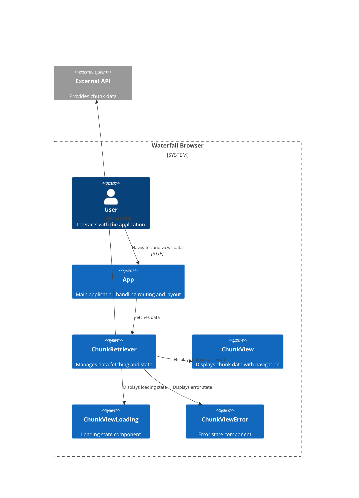

```mermaid
C4Context
  System_Boundary(c1, "Waterfall Browser") {
    Person(user, "User", "Interacts with the application")

    Rel(user, app, "Navigates and views data", "HTTP")

    System(app, "App", "Main application handling routing and layout")
    System(chunk_retriever, "ChunkRetriever", "Manages data fetching and state")
    System(chunk_view, "ChunkView", "Displays chunk data with navigation")
    System(chunk_view_loading, "ChunkViewLoading", "Loading state component")
    System(chunk_view_error, "ChunkViewError", "Error state component")

    Rel(app, chunk_retriever, "Fetches data", "")
    Rel(chunk_retriever, chunk_view, "Displays data if successful", "")
    Rel(chunk_retriever, chunk_view_loading, "Displays loading state", "")
    Rel(chunk_retriever, chunk_view_error, "Displays error state", "")


  }
  System_Ext(api, "External API", "Provides chunk data")

  Rel(chunk_retriever, api, "Fetches data", "HTTPS")

```
