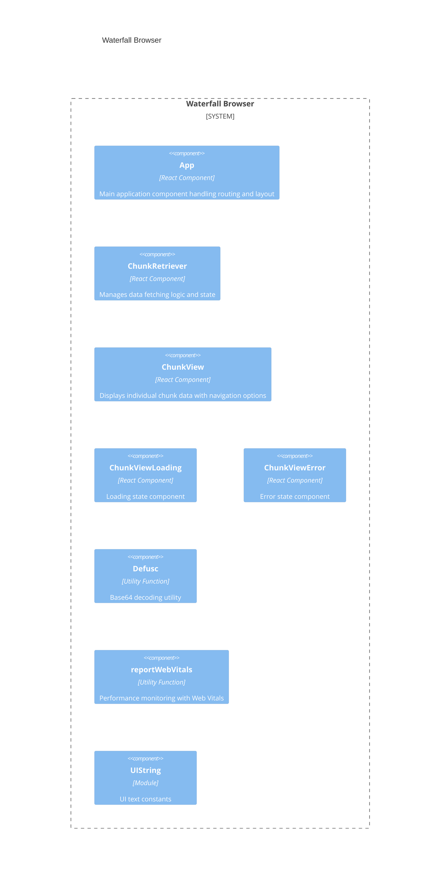

```mermaid
C4Container
   title Waterfall Browser

    System_Boundary(b1, "Waterfall Browser") {
        Component(app, "App", "React Component", "Main application component handling routing and layout")
        Component(chunkRetriever, "ChunkRetriever", "React Component", "Manages data fetching logic and state")
        Component(chunkView, "ChunkView", "React Component", "Displays individual chunk data with navigation options")
        Component(chunkViewLoading, "ChunkViewLoading", "React Component", "Loading state component")
        Component(chunkViewError, "ChunkViewError", "React Component", "Error state component")
        Component(defusc, "Defusc", "Utility Function", "Base64 decoding utility")
        Component(reportWebVitals, "reportWebVitals", "Utility Function", "Performance monitoring with Web Vitals")
        Component(uiString, "UIString", "Module", "UI text constants")
    }

```
