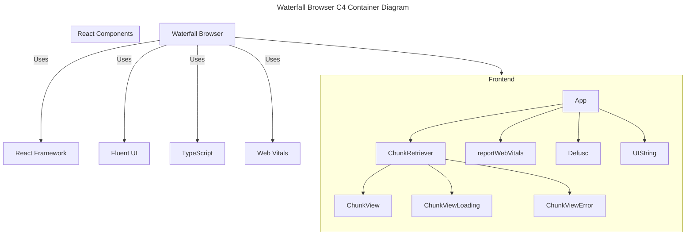

```mermaid
---
title: Waterfall Browser C4 Container Diagram
---
graph TD
    A[Waterfall Browser]
    
    A -->|Uses| B[React Framework]
    A -->|Uses| C[Fluent UI]
    A -->|Uses| D[TypeScript]
    A -->|Uses| E[Web Vitals]

    subgraph Frontend
        direction TB
        F[App]
        G[ChunkRetriever]
        H[ChunkView]
        I[ChunkViewLoading]
        J[ChunkViewError]
        K[Defusc]
        L[reportWebVitals]
        M[UIString]
    end
    
    A --> Frontend

    subgraph React Components
        direction TB
        F[App] --> G[ChunkRetriever]
        G --> H[ChunkView]
        G --> I[ChunkViewLoading]
        G --> J[ChunkViewError]
        F --> L[reportWebVitals]
        F --> K[Defusc]
        F --> M[UIString]
    end
```