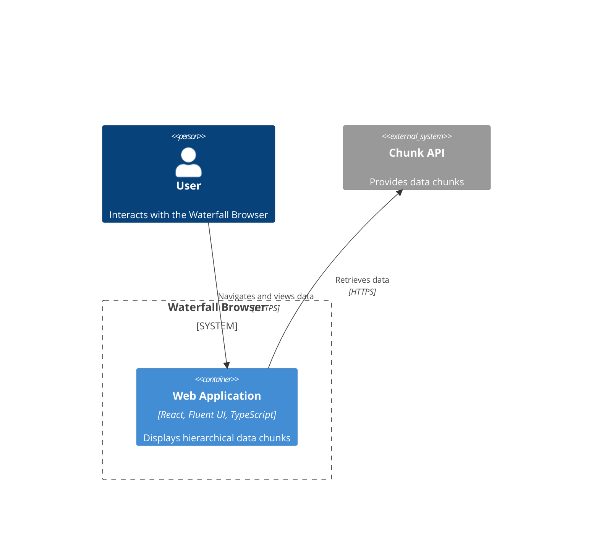

```mermaid
C4Context
  Person(user, "User", "Interacts with the Waterfall Browser")

  System_Boundary(c1, "Waterfall Browser") {
    Container(web_app, "Web Application", "React, Fluent UI, TypeScript", "Displays hierarchical data chunks")
  }

  System_Ext(api, "Chunk API", "Provides data chunks")

  Rel(user, web_app, "Navigates and views data", "HTTPS")
  Rel(web_app, api, "Retrieves data", "HTTPS")

```
