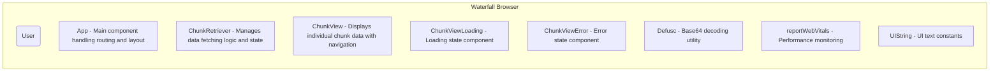

```mermaid
graph TB
    subgraph Waterfall Browser
        direction TB
        User(User)
        App["App - Main component handling routing and layout"]
        ChunkRetriever["ChunkRetriever - Manages data fetching logic and state"]
        ChunkView["ChunkView - Displays individual chunk data with navigation"]
        ChunkViewLoading["ChunkViewLoading - Loading state component"]
        ChunkViewError["ChunkViewError - Error state component"]
        Defusc["Defusc - Base64 decoding utility"]
        reportWebVitals["reportWebVitals - Performance monitoring"]
        UIString["UIString - UI text constants"]
    end
```