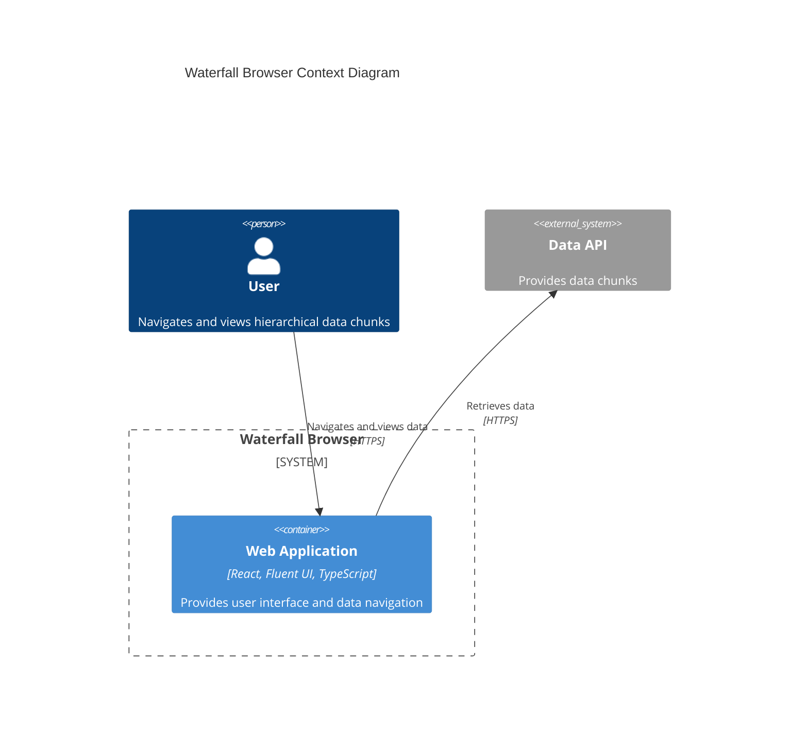

```mermaid
C4Context
title Waterfall Browser Context Diagram

Person(user, "User", "Navigates and views hierarchical data chunks")

System_Boundary(c1, "Waterfall Browser") {
  Container(web_app, "Web Application", "React, Fluent UI, TypeScript", "Provides user interface and data navigation")
}

System_Ext(api, "Data API", "Provides data chunks")

Rel(user, web_app, "Navigates and views data", "HTTPS")
Rel(web_app, api, "Retrieves data", "HTTPS")

```
